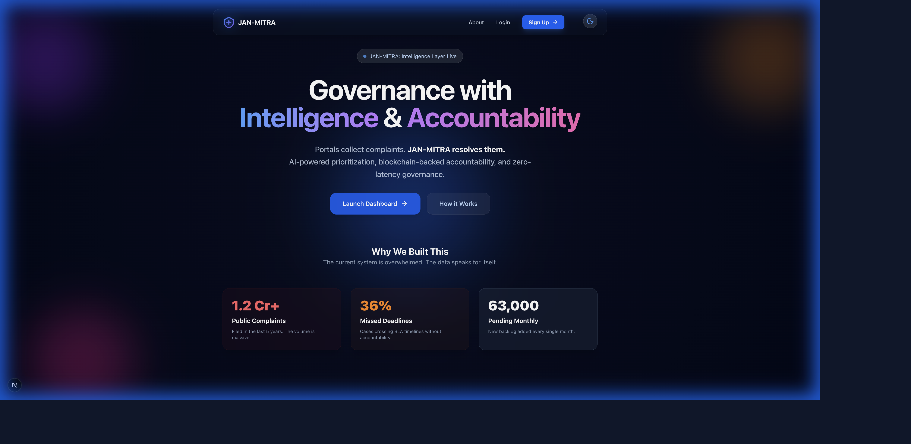
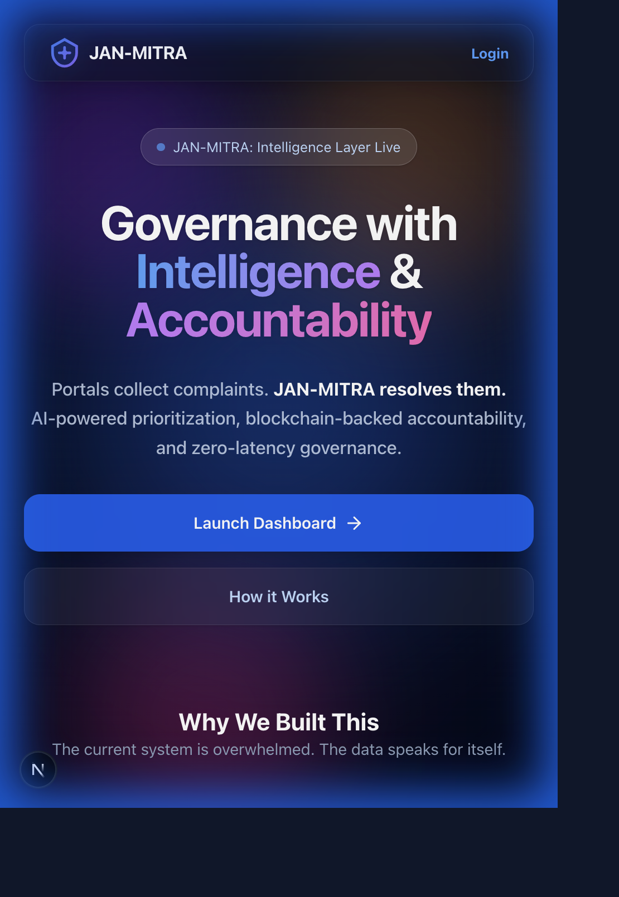
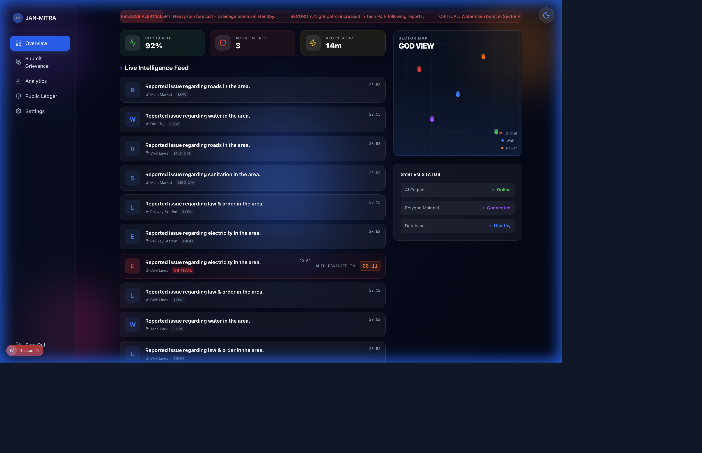
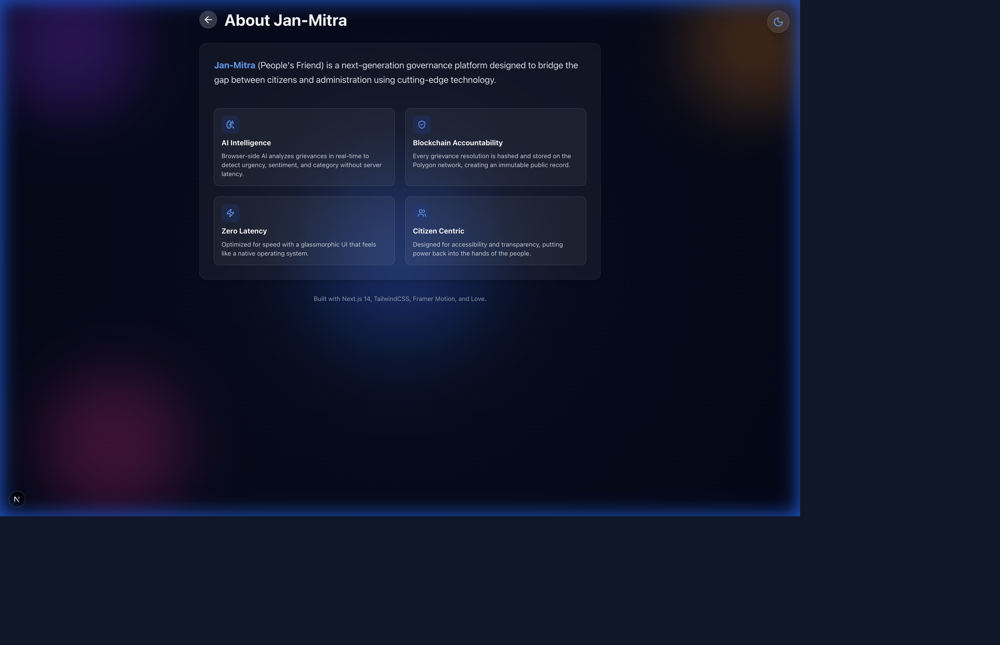
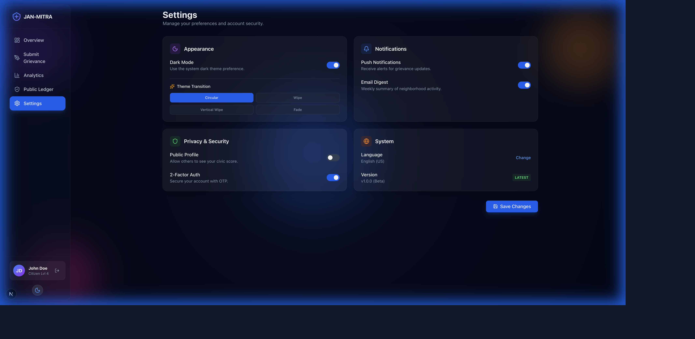
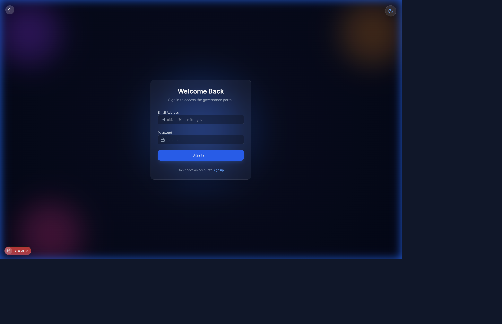

# 🏛️ JAN-MITRA: Governance with Intelligence

[](https://janmitraportal.vercel.app/)
[](https://janmitraportal.vercel.app/)
[](https://nextjs.org/)
[](https://tailwindcss.com/)
[](https://www.typescriptlang.org/)



> **"Delay is just a symptom. The system is the disease."**

**Jan-Mitra** (People's Friend) is a next-generation civic grievance redressal platform designed to bridge the gap between citizens and administration. It moves beyond simple "complaint logging" to **Intelligent Resolution**.

## 🚨 The Reality Check
- **1.2 Crore+** Public complaints filed in the last 5 years.
- **36%** of cases cross SLA deadlines without accountability.
- **63,000+** new cases added to the backlog every month.

Jan-Mitra solves this with **"Understand First, Act Smartly"** logic.

## 🌟 Star History

[](https://star-history.com/#thepriyanshumishra/JanMitra&Date)

---

## 🚀 Features

### 🧠 The Intelligence Layer (AI)
Unlike traditional portals that are just "digital mailboxes," Jan-Mitra understands the problem before a human ever sees it.
-   **Auto-Categorization**: Instantly tags issues (e.g., "Sanitation", "Infrastructure").
-   **Sentiment Analysis**: Detects citizen frustration levels to gauge urgency.
-   **Priority Scoring**: Uses NLP to flag critical keywords (e.g., "flooding", "sparking wire").

### ⛓️ The Accountability Layer (Blockchain)
Trust is built on transparency.
-   **Immutable Ledger**: Every status change is hashed and "stored" on the Polygon network.
-   **Smart SLA**: Auto-escalation timers ensure no grievance is ignored.
-   **Public Audit**: Citizens can verify the journey of their complaint.

### 💎 The Experience Layer (GlassOS)
Government software shouldn't look like it's from 1995.
-   **Glassmorphism UI**: A modern, frosted-glass aesthetic.
-   **Command Center**: A Bento-grid dashboard for high-density information.
-   **PWA Support**: Installable on mobile devices with a native app feel.

---

## 📸 Screenshots

| **Homepage** | **Mobile View (PWA)** |
|:---:|:---:|
|  |  |

| **Command Center** | **About Page** |
|:---:|:---:|
|  |  |

| **Settings** | **Login** |
|:---:|:---:|
|  |  |

---

## 🛠️ Tech Stack

-   **Framework**: [Next.js 14](https://nextjs.org/) (App Router)
-   **Styling**: [Tailwind CSS](https://tailwindcss.com/) + Custom Glass Utilities
-   **Icons**: [Lucide React](https://lucide.dev/)
-   **Charts**: [Recharts](https://recharts.org/)
-   **State**: React Hooks + Context API
-   **PWA**: Next.js Metadata + Manifest

---

## ⚡ Getting Started

### Prerequisites
-   Node.js 18+
-   npm / yarn / pnpm

### Installation

1.  **Clone the repository**
    ```bash
    git clone https://github.com/thepriyanshumishra/JanMitra.git
    cd JanMitra
    ```

2.  **Install dependencies**
    ```bash
    npm install
    ```

3.  **Run the development server**
    ```bash
    npm run dev
    ```

4.  **Open your browser**
    Navigate to [http://localhost:3000](http://localhost:3000)

---

## 🔮 Future Roadmap

-   [x] **Mobile App**: PWA Support for "Add to Home Screen".
-   [ ] **Real Backend**: Integrate Supabase for persistent data.
-   [ ] **Smart Contracts**: Deploy actual Solidity contracts to Polygon Amoy Testnet.
-   [ ] **AI Vision**: Image recognition for pothole detection.

---

Made with ❤️ for **Digital India**.
